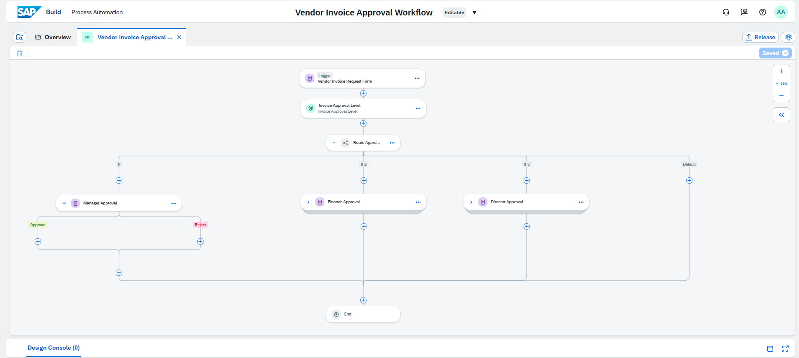
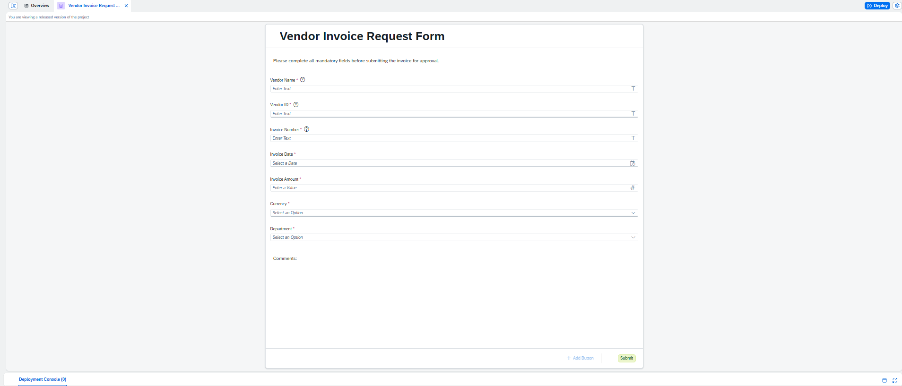
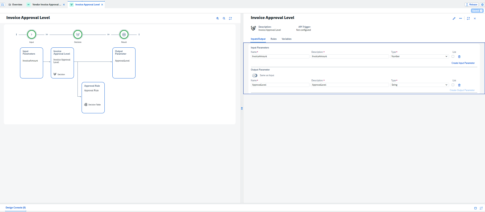
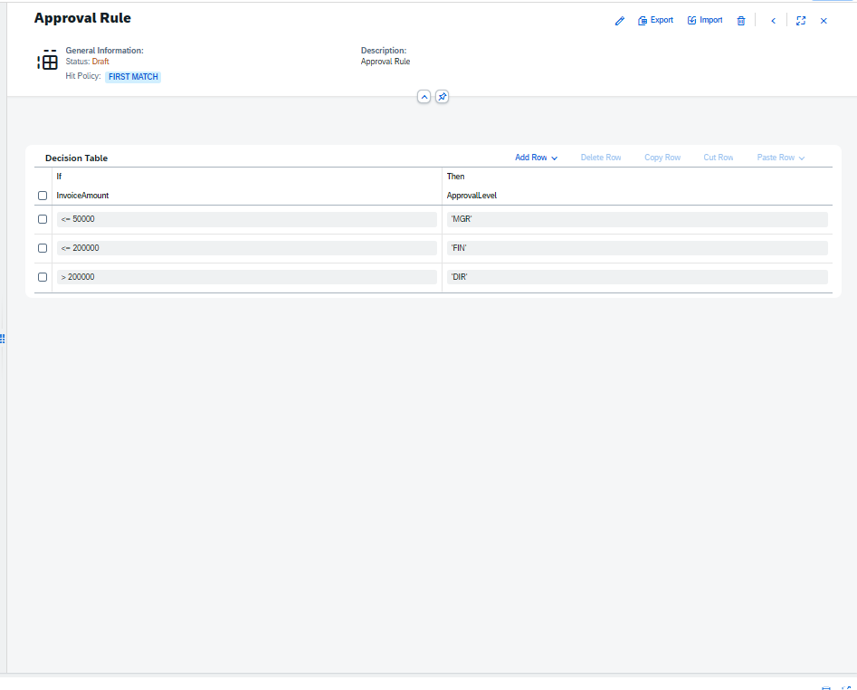
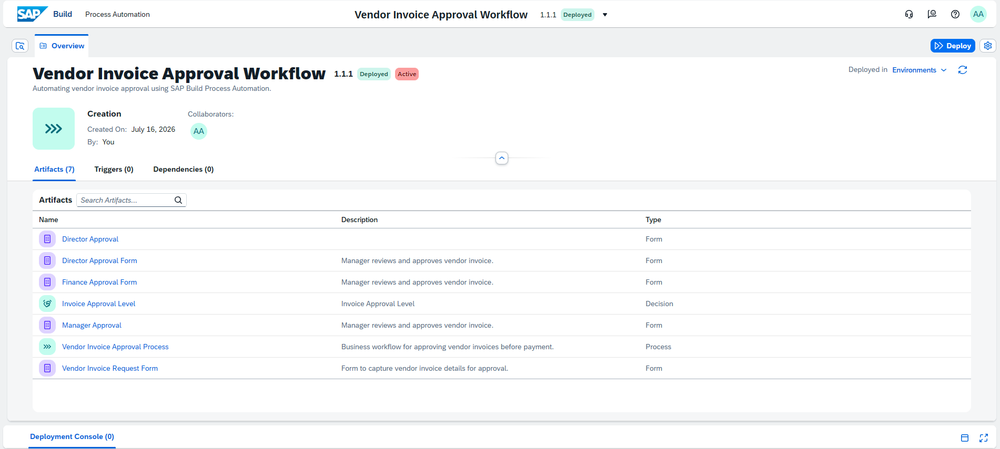

# Vendor Invoice Approval Workflow using SAP Build Process Automation

## Overview

This project demonstrates an enterprise-grade Vendor Invoice Approval Workflow built using **SAP Build Process Automation** on **SAP Business Technology Platform (SAP BTP)**.

The workflow automates invoice approvals by routing requests to different approvers according to invoice amount using a Decision Table.

---

# Business Problem

Manual invoice approvals are:

- Slow
- Error-prone
- Difficult to track
- Require manual routing

This solution automates the approval process using SAP's Low-Code platform.

---

# Workflow

Vendor submits invoice

↓

Decision Table

↓

Manager Approval (≤ 50,000)

OR

Finance Approval (≤ 200,000)

OR

Director Approval (> 200,000)

↓

Workflow Ends

---

# Business Rules

| Invoice Amount | Approval |
|---------------|----------|
| ≤ 50,000 | Manager |
| ≤ 200,000 | Finance |
| > 200,000 | Director |

---

# Technologies Used

- SAP BTP
- SAP Build Process Automation
- SAP Forms
- SAP Decision Tables
- Workflow Automation
- Business Rules

---

# Features

- Vendor Invoice Request Form
- Dynamic Approval Routing
- Decision Table
- Multi-Level Approval Workflow
- Rule-Based Processing
- Low-Code Automation
- SAP Build Deployment

---

# Screenshots

## Workflow

---

## Vendor Request Form

---

## Decision Table

---

## Approval Rule

---

## Deployment

---

# Project Learnings

Through this project I learned:

- SAP Build Process Automation
- SAP BTP Project Lifecycle
- Workflow Design
- Forms Development
- Decision Tables
- Business Rules
- Release Management
- Deployment
- Version Management

---

# Skills Demonstrated

- Business Process Automation
- Enterprise Workflow Design
- SAP BTP
- SAP BPA
- Decision Management
- Process Modeling
- Low-Code Development

---

# Future Improvements

- SAP S/4HANA Integration
- Email Notifications
- Purchase Order Validation
- Vendor Master Validation
- Approval History Dashboard
- Analytics using SAP Build Apps

---

## Author

**Aamir Suhail**

PGDM | Business Analytics | SAP Build Process Automation | Power BI | Business Analyst

LinkedIn:
(www.linkedin.com/in/astamirsuhail)

GitHub:
(Add your GitHub Profile URL)
